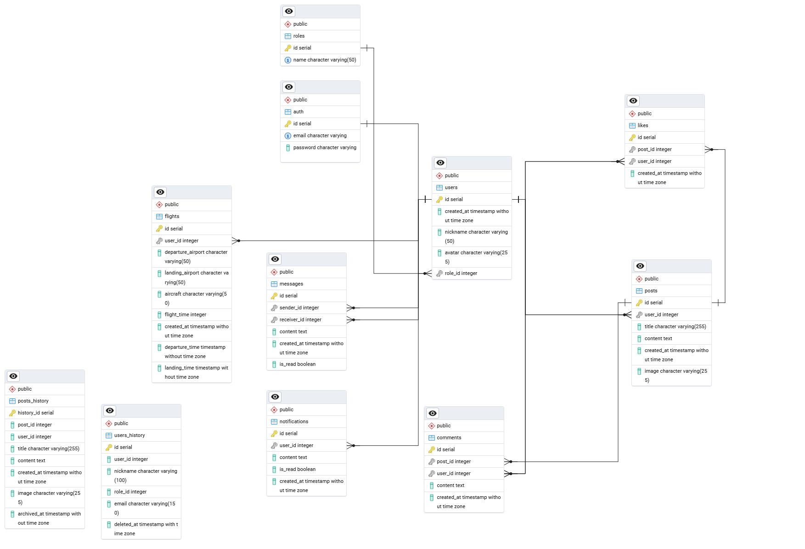
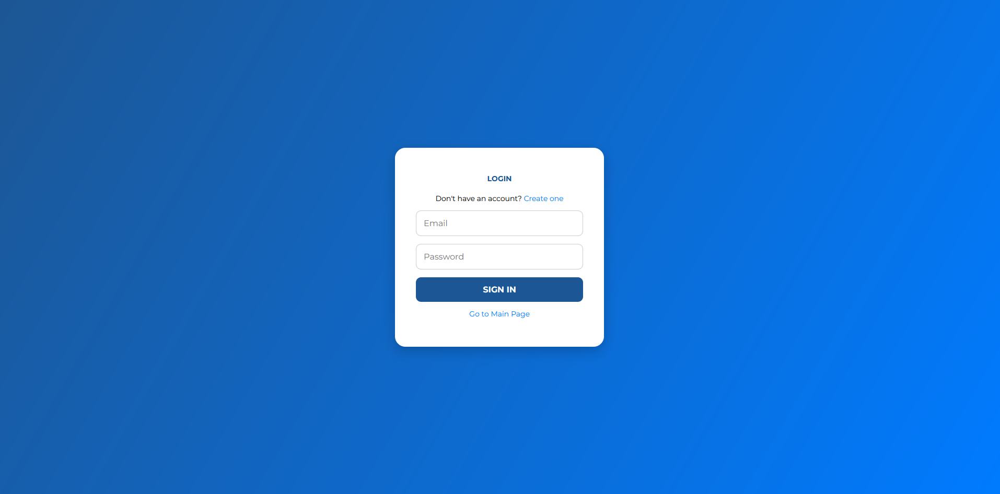
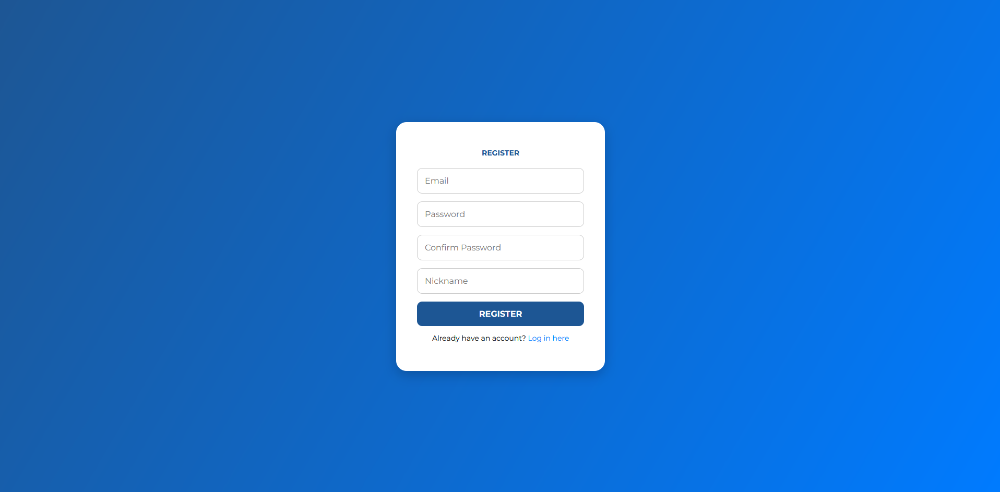
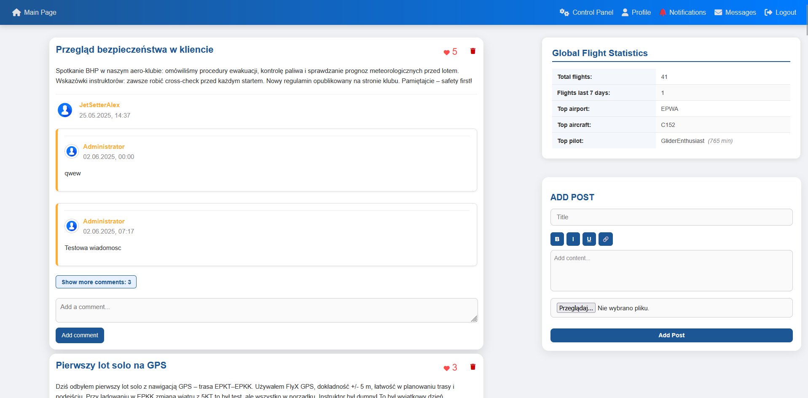
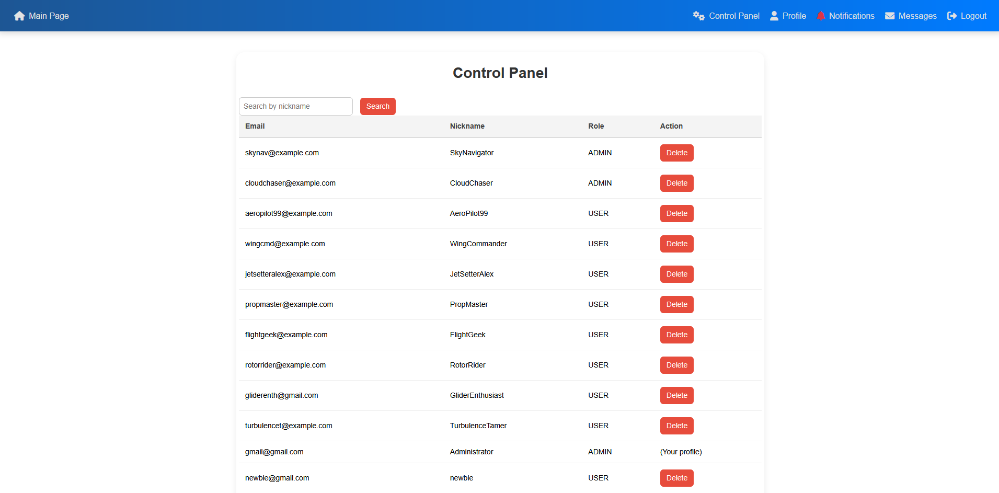
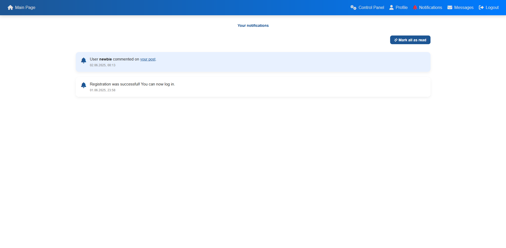
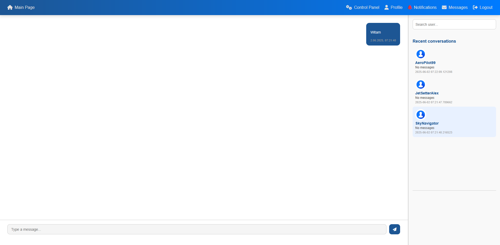

# FlyLog

## Przegląd projektu
FlyLog to aplikacja webowa dla pilotów do zarządzania i rejestrowania lotów. Platforma oferuje:

- Rejestrację i logowanie użytkowników
- Dodawanie i usuwanie wpisów do logbooka
- Funkcje społecznościowe: posty, komentarze, polubienia, powiadomienia i czat
- Zarządzanie profilem z możliwością przesyłania awatara
- Panel administratora do zarządzania użytkownikami
- Responsywny interfejs na komputery i urządzenia mobilne

Zbudowana w PHP 8+, PostgreSQL, Dockerze i Apache.

---

## Kluczowe funkcje
- **Uwierzytelnianie:** Bezpieczna rejestracja, logowanie i zarządzanie sesją
- **Dziennik lotów:** Dodawanie, edycja i przeglądanie własnych lotów
- **Posty i komentarze:** Dodawanie nowych postów, komentowanie i lajkowanie
- **Powiadomienia:** Powiadomienia o nowych postach i pomyslnej rejestracji
- **Czat:** Wiadomości bezpośrednie między użytkownikami
- **Profil:** Przesyłanie awatara, nick, dostęp do statystyk lotów
- **Panel administratora:** Zarządzanie użytkownikami
- **Responsywny design:** Optymalizacja na każde urządzenie

---

## Bezpieczeństwo
- Hasła hashowane przez `password_hash()` (bcrypt)
- Zapytania SQL parametryzowane (ochrona przed SQL Injection)
- Zarządzanie sesją przez `session_start()` i bezpieczne ciasteczka
- Walidacja plików przy przesyłaniu awatara

---

## Scenariusze użycia
1. **Dodaj nowy lot:** Wprowadź szczegóły, samolot, lotnisko, czas startu i odlotu
2. **Udostępnij post:** Publikuj aktualności lub pytania społeczności
3. **Komentuj i lajkuj:** Wchodź w interakcje z postami innych pilotów
4. **Odczytuj powiadomienia:** Bądź na bieżąco z aktywnością
5. **Czat:** Wysyłaj wiadomości do innych użytkowników
6. **Zarządzaj profilem:** Zmień awatar i zarządzaj lotami
7. **Działania administratora:** Zarządzaj użytkownikami i moderuj treści

---

## Typy modułów
- **Loty:** Wpisy dziennika z samolotem, lotniskami i nalotem
- **Posty:** Tablica społeczności do dzielenia się i dyskusji
- **Komentarze:** Dyskusje pod postami
- **Powiadomienia:** Alerty o nowej aktywności
- **Wiadomości:** Prywatny czat między użytkownikami
- **Profil:** Informacje o użytkowniku i awatar
- **Admin:** Zarządzanie użytkownikami i rolami

---

## Struktura bazy danych
- **PostgreSQL** z tabelami: użytkownicy, loty, posty, komentarze, powiadomienia, wiadomości, role
- **Widoki** dla wydajnego czatu i ról użytkowników
- **Triggery** do powiadomień rejestracyjnych i kaskadowego usuwania
- **Dane testowe** w `init.sql`

---

## Struktura projektu
```
FlyLog/
├─ docker/             # Pliki Dockerfile i konfiguracje
├─ public/             # Zasoby publiczne
│  ├─ js/              # Moduły JavaScript
│  ├─ styles/          # Style CSS
│  ├─ views/           # Szablony PHP
├─ src/                # MVC (Model, Widok, Kontroler)
│  ├─ controllers/     # Kontrolery
│  ├─ models/          # Encje
│  ├─ repository/      # Dostęp do danych
├─ uploads/avatars/    # Awatary użytkowników
├─ docker-compose.yaml # Orkiestracja Dockera
├─ Routing.php         # Logika routingu
├─ index.php           # Front controller
├─ init.sql/           # Schemat bazy i dane testowe
```

---

## Skrypty JavaScript i API
- `public/js/comments.js`: System komentarzy (AJAX)
- `public/js/flights.js`: Operacje na dzienniku lotów
- `public/js/like.js`: Lajkowanie/odlajkowanie postów
- `public/js/messages.js`: Funkcjonalność czatu
- `public/js/navbar.js`: Interaktywność paska nawigacji
- `public/js/notifications.js`: Powiadomienia
- `public/js/regnot.js`: Logika powiadomień rejestracyjnych
- `public/js/toggleAddPost.js`: Animacja edytora postów

---

## Instrukcja uruchomienia
1. Zainstaluj Docker i Docker Compose
2. Sklonuj repozytorium:
   ```powershell
   git clone <repo-url>
   cd WDPAIFLYLOG
   ```
3. Zbuduj i uruchom kontenery:
   ```powershell
   docker-compose up --build
   ```
4. (Opcjonalnie) Załaduj `init.sql` do bazy danych, aby mieć dane testowe

Aplikacja będzie dostępna pod adresem [http://localhost:8080](http://localhost:8080)

---

## ERD bazy danych


---

## Zrzuty ekranu
**Logowanie**

**Rejestracja**

**Strona główna**

**Panel sterowania**

**Profil**

**Powiadomienia**

**Wiadomości**


---

## Autor
*Daniel Gadzina*

---
